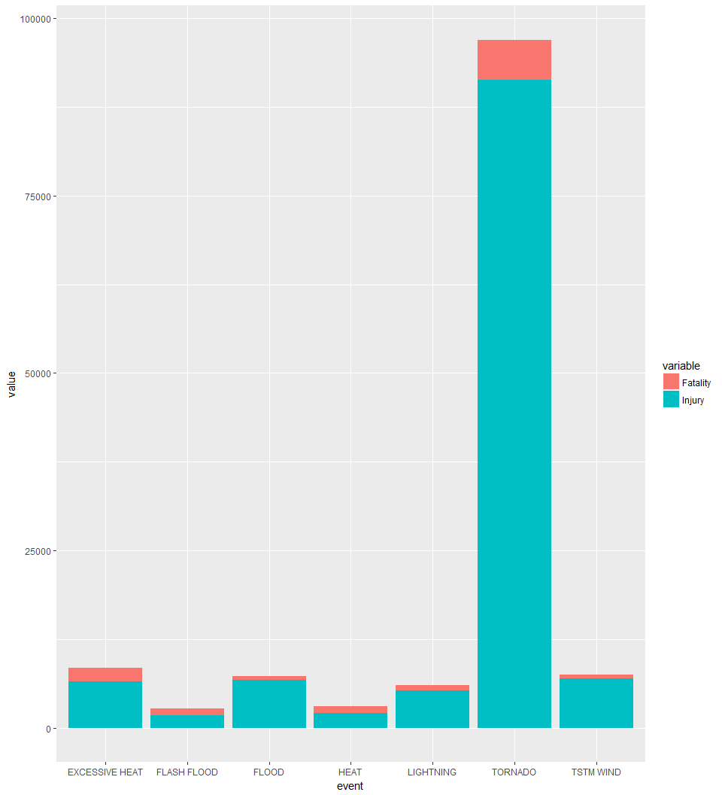
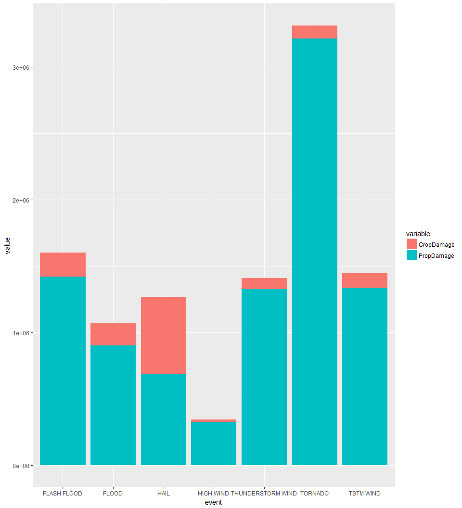

# Health Effects and Economic Consequences By Different Storm Events
Wenting Rohwer  
June 28, 2017  

#### The U.S. National Oceanic and Atmospheric Administration's (NOAA) storm database tracks characteristics of major storms and weather events in the United States, including when and where they occur, as well as estimates of any fatalities, injuries, and property damage. This document explors NOAA storm database and answers the two following questions.

#### 1. Across the United States, which types of events (as indicated in the EVTYPE variable) are most harmful with respect to population health?

#### 2. Across the United States, which types of events have the greatest economic consequences?

#### The following code reveals that tornado is the most davastating event for human health as well as economy. Flood, wind, heat are also among the top events for causing human health and economy damages.


```r
library(data.table)
library(ggplot2)
library(dplyr)
```

```
## 
## Attaching package: 'dplyr'
```

```
## The following objects are masked from 'package:data.table':
## 
##     between, first, last
```

```
## The following objects are masked from 'package:stats':
## 
##     filter, lag
```

```
## The following objects are masked from 'package:base':
## 
##     intersect, setdiff, setequal, union
```
Load the data


```r
stormData <- fread('StormData.csv')
```

```
## 
Read 10.3% of 967216 rows
Read 27.9% of 967216 rows
Read 41.4% of 967216 rows
Read 54.8% of 967216 rows
Read 71.3% of 967216 rows
Read 78.6% of 967216 rows
Read 84.8% of 967216 rows
Read 902297 rows and 37 (of 37) columns from 0.523 GB file in 00:00:10
```

```r
dim(stormData)
```

```
## [1] 902297     37
```

```r
names(stormData)
```

```
##  [1] "STATE__"    "BGN_DATE"   "BGN_TIME"   "TIME_ZONE"  "COUNTY"    
##  [6] "COUNTYNAME" "STATE"      "EVTYPE"     "BGN_RANGE"  "BGN_AZI"   
## [11] "BGN_LOCATI" "END_DATE"   "END_TIME"   "COUNTY_END" "COUNTYENDN"
## [16] "END_RANGE"  "END_AZI"    "END_LOCATI" "LENGTH"     "WIDTH"     
## [21] "F"          "MAG"        "FATALITIES" "INJURIES"   "PROPDMG"   
## [26] "PROPDMGEXP" "CROPDMG"    "CROPDMGEXP" "WFO"        "STATEOFFIC"
## [31] "ZONENAMES"  "LATITUDE"   "LONGITUDE"  "LATITUDE_E" "LONGITUDE_"
## [36] "REMARKS"    "REFNUM"
```
#### 1. Across the United States, which types of events (as indicated in the EVTYPE variable) are most harmful with respect to population health?

##### Assumption: Harm to population health is measured by variables 'FATALITIES' and 'INJURIES'

To reduce data processing time, we will only work with data what we are concerned with, 'EVTYPE','FATALITIES','INJURIES'

```r
healthStormData <- stormData[,c('EVTYPE','FATALITIES','INJURIES')]
```


```r
head(healthStormData,3)
```

```
##     EVTYPE FATALITIES INJURIES
## 1: TORNADO          0       15
## 2: TORNADO          0        0
## 3: TORNADO          0        2
```


```r
eventInjury <- healthStormData[,-c(2)]
eventFat <- healthStormData[,-c(3)]
```

```r
dim(eventFat)
```

```
## [1] 902297      2
```

```r
length(which(eventFat$FATALITIES==0))
```

```
## [1] 895323
```

```r
length(which(eventFat$FATALITIES==0))/length(eventFat$FATALITIES)
```

```
## [1] 0.9922708
```

```r
dim(eventInjury)
```

```
## [1] 902297      2
```

```r
length(which(eventInjury$INJURIES==0))
```

```
## [1] 884693
```

```r
length(which(eventInjury$INJURIES==0))/length(eventInjury$INJURIES)
```

```
## [1] 0.9804898
```
So out of 900 thousands rows, 98% -99% of the data is zero. Most of the events doesn't cause harm in heath.

```r
cleaneventInjury <- eventInjury[(eventInjury$INJURIES != 0),]
cleaneventFat <- eventFat[(eventFat$FATALITIES != 0),]
```

```r
sapply(list(cleaneventFat,cleaneventInjury),dim)
```

```
##      [,1]  [,2]
## [1,] 6974 17604
## [2,]    2     2
```

```r
cleaneventFat <- melt(tapply(cleaneventFat$FATALITIES, cleaneventFat$EVTYPE, sum))
cleaneventInjury <- melt(tapply(cleaneventInjury$INJURIES,cleaneventInjury$EVTYPE,sum))
```

```r
sapply(list(cleaneventFat,cleaneventInjury),dim)
```

```
##      [,1] [,2]
## [1,]  168  158
## [2,]    2    2
```


```r
head(cleaneventFat,3)
```

```
##        Var1 value
## 1  AVALANCE     1
## 2 AVALANCHE   224
## 3 BLACK ICE     1
```

```r
head(cleaneventInjury,3)
```

```
##        Var1 value
## 1 AVALANCHE   170
## 2 BLACK ICE    24
## 3  BLIZZARD   805
```

```r
names(cleaneventFat) <- c('event','Fatality')
names(cleaneventInjury) <- c('event','Injury')
```

```r
topEventFat <- arrange(cleaneventFat,desc(cleaneventFat$Fatality))[c(1:10),]
topEventInj <- arrange(cleaneventInjury,desc(cleaneventInjury$Injury))[c(1:10),]
```

```r
head(topEventFat)
```

```
##            event Fatality
## 1        TORNADO     5633
## 2 EXCESSIVE HEAT     1903
## 3    FLASH FLOOD      978
## 4           HEAT      937
## 5      LIGHTNING      816
## 6      TSTM WIND      504
```

```r
head(topEventInj)
```

```
##            event Injury
## 1        TORNADO  91346
## 2      TSTM WIND   6957
## 3          FLOOD   6789
## 4 EXCESSIVE HEAT   6525
## 5      LIGHTNING   5230
## 6           HEAT   2100
```

```r
totalEventHarm <- merge(topEventFat,topEventInj)
totalEventHarm
```

```
##            event Fatality Injury
## 1 EXCESSIVE HEAT     1903   6525
## 2    FLASH FLOOD      978   1777
## 3          FLOOD      470   6789
## 4           HEAT      937   2100
## 5      LIGHTNING      816   5230
## 6        TORNADO     5633  91346
## 7      TSTM WIND      504   6957
```

```r
totalEventHarm <- melt(totalEventHarm, id='event')
totalEventHarm
```

```
##             event variable value
## 1  EXCESSIVE HEAT Fatality  1903
## 2     FLASH FLOOD Fatality   978
## 3           FLOOD Fatality   470
## 4            HEAT Fatality   937
## 5       LIGHTNING Fatality   816
## 6         TORNADO Fatality  5633
## 7       TSTM WIND Fatality   504
## 8  EXCESSIVE HEAT   Injury  6525
## 9     FLASH FLOOD   Injury  1777
## 10          FLOOD   Injury  6789
## 11           HEAT   Injury  2100
## 12      LIGHTNING   Injury  5230
## 13        TORNADO   Injury 91346
## 14      TSTM WIND   Injury  6957
```


```r
ggplot(data=totalEventHarm, aes(x=event, y=value, fill=variable)) + geom_bar(stat = 'identity')
```

<!-- -->

***

Answer: 
The most harmful event to human health is Tornado.

The top events caused fatality includes:
    TORNADO, EXCESSIVE HEAT,FLASH FLOOD
    
The top events caused injuries includes:
    TORNADO,TSTM WIND, FLOOD, EXCESSIVE HEAT

***

#### 2. Across the United States, which types of events have the greatest economic consequences?

##### Assumption: economic consequences are measured by variables 'PROPDMG' and 'CROPDMG'

Similarly, we could do the same process for 'PROPDMG' and 'CROPDMG'.

```r
econStormData <- stormData[,c('EVTYPE','PROPDMG','CROPDMG')]
```


```r
head(econStormData,3)
```

```
##     EVTYPE PROPDMG CROPDMG
## 1: TORNADO    25.0       0
## 2: TORNADO     2.5       0
## 3: TORNADO    25.0       0
```


```r
eventCrop <- econStormData[,-c(2)]
eventProp <- econStormData[,-c(3)]
```

```r
dim(eventCrop)
```

```
## [1] 902297      2
```

```r
length(which(eventCrop$CROPDMG==0))
```

```
## [1] 880198
```

```r
length(which(eventCrop$CROPDMG==0))/length(eventCrop$CROPDMG)
```

```
## [1] 0.9755081
```

```r
dim(eventProp)
```

```
## [1] 902297      2
```

```r
length(which(eventProp$PROPDMG==0))
```

```
## [1] 663123
```

```r
length(which(eventProp$PROPDMG==0))/length(eventProp$PROPDMG)
```

```
## [1] 0.7349276
```
So out of 900 thousands rows, 73% -97% of the data is zero. Most of the events doesn't cause damage in economy.

```r
cleaneventProp <- eventProp[(eventProp$PROPDMG != 0),]
cleaneventCrop <- eventCrop[(eventCrop$CROPDMG != 0),]
```

```r
sapply(list(cleaneventCrop,cleaneventProp),dim)
```

```
##       [,1]   [,2]
## [1,] 22099 239174
## [2,]     2      2
```


```r
cleaneventCrop <- melt(tapply(cleaneventCrop$CROPDMG, cleaneventCrop$EVTYPE, sum))
cleaneventProp <- melt(tapply(cleaneventProp$PROPDMG,cleaneventProp$EVTYPE,sum))
```

```r
sapply(list(cleaneventCrop,cleaneventProp),dim)
```

```
##      [,1] [,2]
## [1,]  136  406
## [2,]    2    2
```

```r
head(cleaneventCrop,3)
```

```
##                  Var1  value
## 1 AGRICULTURAL FREEZE  28.82
## 2            BLIZZARD 172.00
## 3    COASTAL FLOODING  56.00
```

```r
head(cleaneventProp,3)
```

```
##                    Var1 value
## 1    HIGH SURF ADVISORY   200
## 2           FLASH FLOOD    50
## 3             TSTM WIND   108
```

```r
names(cleaneventCrop) <- c('event','CropDamage')
names(cleaneventProp) <- c('event','PropDamage')
```

```r
topEventCrop <- arrange(cleaneventCrop,desc(cleaneventCrop$CropDamage))[c(1:10),]
topEventProp <- arrange(cleaneventProp,desc(cleaneventProp$PropDamage))[c(1:10),]
```

```r
head(topEventCrop)
```

```
##               event CropDamage
## 1              HAIL  579596.28
## 2       FLASH FLOOD  179200.46
## 3             FLOOD  168037.88
## 4         TSTM WIND  109202.60
## 5           TORNADO  100018.52
## 6 THUNDERSTORM WIND   66791.45
```

```r
head(topEventProp)
```

```
##               event PropDamage
## 1           TORNADO  3212258.2
## 2       FLASH FLOOD  1420124.6
## 3         TSTM WIND  1335965.6
## 4             FLOOD   899938.5
## 5 THUNDERSTORM WIND   876844.2
## 6              HAIL   688693.4
```

```r
totalEconEventHarm <- merge(topEventCrop,topEventProp)
totalEconEventHarm
```

```
##                event CropDamage PropDamage
## 1        FLASH FLOOD  179200.46  1420124.6
## 2              FLOOD  168037.88   899938.5
## 3               HAIL  579596.28   688693.4
## 4          HIGH WIND   17283.21   324731.6
## 5  THUNDERSTORM WIND   66791.45   876844.2
## 6 THUNDERSTORM WINDS   18684.93   446293.2
## 7            TORNADO  100018.52  3212258.2
## 8          TSTM WIND  109202.60  1335965.6
```
noticed the THUNDERSTORM WIND and THUNDERSTORM WINDS is very likely to be the same event

```r
totalEconEventHarm[5,][c(2,3)] <- totalEconEventHarm[5,][c(2,3)]+totalEconEventHarm[6,][c(2,3)]
totalEconEventHarm <- totalEconEventHarm[-6,]
totalEconEventHarm
```

```
##               event CropDamage PropDamage
## 1       FLASH FLOOD  179200.46  1420124.6
## 2             FLOOD  168037.88   899938.5
## 3              HAIL  579596.28   688693.4
## 4         HIGH WIND   17283.21   324731.6
## 5 THUNDERSTORM WIND   85476.38  1323137.4
## 7           TORNADO  100018.52  3212258.2
## 8         TSTM WIND  109202.60  1335965.6
```


```r
totalEconEventHarm <- melt(totalEconEventHarm, id='event')
totalEconEventHarm
```

```
##                event   variable      value
## 1        FLASH FLOOD CropDamage  179200.46
## 2              FLOOD CropDamage  168037.88
## 3               HAIL CropDamage  579596.28
## 4          HIGH WIND CropDamage   17283.21
## 5  THUNDERSTORM WIND CropDamage   85476.38
## 6            TORNADO CropDamage  100018.52
## 7          TSTM WIND CropDamage  109202.60
## 8        FLASH FLOOD PropDamage 1420124.59
## 9              FLOOD PropDamage  899938.48
## 10              HAIL PropDamage  688693.38
## 11         HIGH WIND PropDamage  324731.56
## 12 THUNDERSTORM WIND PropDamage 1323137.35
## 13           TORNADO PropDamage 3212258.16
## 14         TSTM WIND PropDamage 1335965.61
```


```r
ggplot(data=totalEconEventHarm, aes(x=event, y=value, fill=variable)) + geom_bar(stat = 'identity')
```

<!-- -->

***

Answer: 
The most damaging event to economy is Tornado due to its massive damage to property damage.

The top events caused crop damages includes:
HAIL,FLASH FLOOD,FLOOD,TSTM WIND

The top events caused property includes:
TORNADO, FLASH FLOOD,TSTM WIND,FLOOD

***
